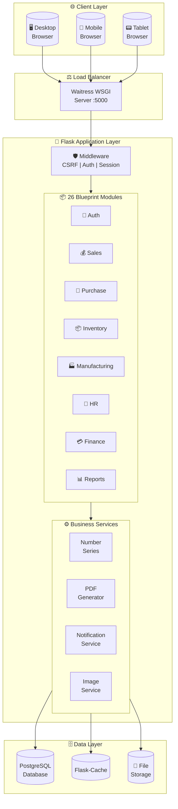
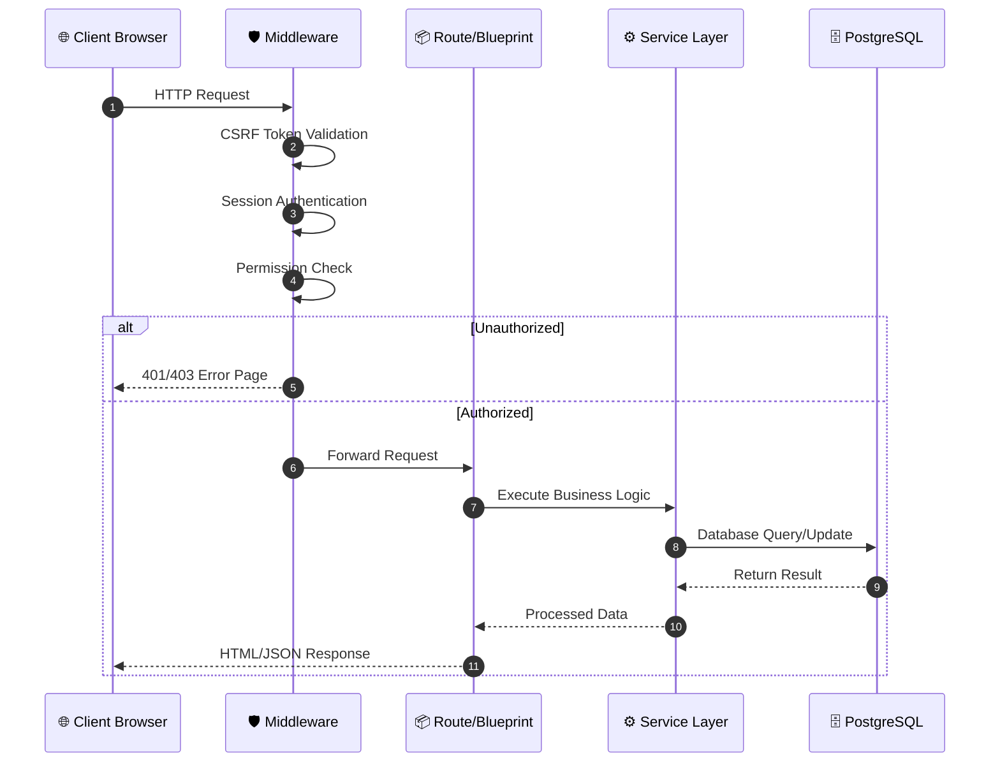

# 🏢 Enterprise Resource Planning (ERP) System

<div align="center">


**A production-ready, full-featured ERP system for small & medium businesses**

[Features](#-key-features) • [Architecture](#-system-architecture) • [Modules](#-module-overview) • [Screenshots](#-screenshots) • [Tech Stack](#️-tech-stack)

</div>

---

## 📋 Overview

A comprehensive **Enterprise Resource Planning (ERP)** system built from scratch using Python Flask and PostgreSQL. This system manages complete business operations including **Sales, Purchase, Inventory, Manufacturing, HR, and Finance** modules with multi-user LAN support.

### 🎯 Key Highlights

| Metric | Details |
|--------|---------|
| 📊 **Database Models** | 77+ interconnected tables |
| 🔌 **API Modules** | 26 Flask Blueprints |
| 🔐 **Permissions** | 50+ granular permissions |
| 👥 **Multi-User** | LAN-based concurrent access |
| 📱 **Responsive** | Works on desktop, tablet, mobile |
| 🖨️ **Reports** | PDF & Excel export support |

---

## 🏗 System Architecture

### High-Level Overview



## Request-Response Flow



## 🔐 Authentication System
Login Flow with 2FA Support

```
flowchart TD
    A["🔑 Login Page"] --> B{Valid<br/>Credentials?}
    B -->|No| C["❌ Increment<br/>Failed Count"]
    C --> D{Failed >= 5?}
    D -->|Yes| E["🔒 Lock Account<br/>for 30 minutes"]
    D -->|No| A
    
    B -->|Yes| F{2FA<br/>Enabled?}
    F -->|No| G["✅ Create Session"]
    F -->|Yes| H["📱 Enter OTP"]
    H --> I{OTP Valid?}
    I -->|No| J["❌ Invalid OTP"]
    J --> H
    I -->|Yes| G
    
    G --> K["🏠 Redirect to Dashboard"]
    
    E --> L["⏰ Wait 30 minutes"]
    L --> A

    style A fill:#e1f5fe
    style G fill:#c8e6c9
    style E fill:#ffcdd2
    style K fill:#c8e6c9
```

## Role-Based Access Control (RBAC)

```
flowchart LR
    subgraph Users["👥 Users"]
        U1["Admin"]
        U2["Sales Manager"]
        U3["Purchase Manager"]
        U4["Inventory Staff"]
        U5["HR Manager"]
        U6["Accountant"]
    end

    subgraph Roles["🎭 Roles"]
        R1["Admin Role"]
        R2["Sales Role"]
        R3["Purchase Role"]
        R4["Inventory Role"]
        R5["HR Role"]
        R6["Finance Role"]
    end

    subgraph Permissions["🔑 Permissions (50+)"]
        P1["view_sales<br/>create_sales<br/>approve_sales"]
        P2["view_purchase<br/>create_po<br/>approve_po"]
        P3["view_inventory<br/>stock_adjustment"]
        P4["view_hr<br/>manage_payroll"]
        P5["view_finance<br/>process_payment"]
    end

    U1 --> R1
    U2 --> R2
    U3 --> R3
    U4 --> R4
    U5 --> R5
    U6 --> R6

    R1 -->|ALL PERMISSIONS| P1 & P2 & P3 & P4 & P5
    R2 --> P1
    R3 --> P2
    R4 --> P3
    R5 --> P4
    R6 --> P5

 ```

## 📦 Module Overview
Module Interaction Diagram

```
flowchart TB
    subgraph Sales["💰 SALES MODULE"]
        CUS[("👤 Customers")]
        QUO["📝 Quotations"]
        SO["📋 Sales Orders"]
        INV_S["🧾 Invoices"]
        PAY["💵 Payments"]
    end

    subgraph Purchase["🛒 PURCHASE MODULE"]
        SUP[("🏭 Suppliers")]
        PR["📄 Purchase Req"]
        SQ["📊 Supplier Quotes"]
        PO["📦 Purchase Orders"]
        GRN["✅ GRN"]
    end

    subgraph Inventory["📦 INVENTORY MODULE"]
        PRD[("📱 Products")]
        MAT[("🔧 Materials")]
        STK["📊 Stock"]
        MOV["🔄 Movements"]
        BAR["🏷️ Barcodes"]
    end

    subgraph Manufacturing["🏭 MANUFACTURING"]
        PRJ["📋 Projects"]
        BOM["📑 BOM"]
        WO["🔨 Work Orders"]
        PROD["⚙️ Production"]
    end

    subgraph HR["👥 HR MODULE"]
        EMP[("👤 Employees")]
        ATT["📅 Attendance"]
        SAL["💰 Payroll"]
        LVE["🏖️ Leave Mgmt"]
    end

    subgraph Finance["💳 FINANCE"]
        ACC["📊 Accounts"]
        PYMNT["💵 Payments"]
        RPTS["📈 Reports"]
    end

    CUS --> QUO --> SO --> INV_S --> PAY
    SO --> PRJ
    PRJ --> BOM --> WO --> PROD
    BOM --> PR --> SQ --> PO --> GRN
    GRN --> STK
    PROD --> STK
    STK --> MOV
    PRD & MAT --> STK
    INV_S --> PYMNT --> RPTS
    EMP --> ATT --> SAL
    EMP --> LVE
 ```
## Detailed Module Breakdown

```
mindmap
  root((🏢 ERP System))
    💰 Sales
      👤 Customer Management
      📝 Quotation with Revisions
      📋 Sales Order
      🧾 Invoice Generation
      💵 Payment Tracking
      📄 Debit/Credit Notes
    🛒 Purchase
      🏭 Supplier Management
      📄 Purchase Requisition
      📊 Supplier Quotation
      📦 Purchase Order
      ✅ GRN - Goods Receipt
      ⭐ Vendor Performance
    📦 Inventory
      📱 Product Master
      🔧 Material Master
      🏪 Multi-Location Stock
      🔄 Stock Movements
      🏷️ Barcode Generation
      📊 Low Stock Alerts
    🏭 Manufacturing
      📋 Project Management
      📑 Bill of Materials
      🔨 Work Orders
      ⚙️ Production Entry
      📉 Material Consumption
    👥 HR
      👤 Employee Master
      📅 Attendance Tracking
      🏖️ Leave Management
      💰 Payroll & Salary
      📄 HR Documents
      🎓 Training Programs
      🚪 Exit Process
    ⚡ Electrical Inventory
      🔌 Material Master
      📥 Stock Entry
      🤝 Handover Tracking
      ↩️ Return Processing
      📜 Transaction Log
    📊 Reports
      📈 Dashboard Analytics
      📄 PDF Generation
      📊 Excel Export
      🔍 Custom Reports
```
## 🔄 Business Process Flows
Order to Cash (O2C) Flow

```
flowchart LR
    A["👤 Customer<br/>Inquiry"] --> B["📝 Create<br/>Quotation"]
    B --> C{"Customer<br/>Approved?"}
    C -->|No| D["📝 Revise<br/>Quotation"]
    D --> B
    C -->|Yes| E["📋 Create<br/>Sales Order"]
    E --> F["🏭 Create<br/>Work Order"]
    F --> G["⚙️ Start<br/>Production"]
    G --> H["📦 Stock<br/>Ready"]
    H --> I["🧾 Generate<br/>Invoice"]
    I --> J["🚚 Dispatch<br/>Goods"]
    J --> K["💵 Receive<br/>Payment"]
    K --> L["✅ Close<br/>Order"]

    style A fill:#e3f2fd
    style L fill:#c8e6c9
```
## Procure to Pay (P2P) Flow
```
flowchart LR
    A["📋 Material<br/>Requirement"] --> B["📄 Create<br/>PR"]
    B --> C{"Level 1<br/>Approval"}
    C -->|Reject| D["❌ Return to<br/>Creator"]
    C -->|Approve| E{"Level 2<br/>Approval"}
    E -->|Reject| D
    E -->|Approve| F["📊 Request<br/>Supplier Quotes"]
    F --> G["📈 Compare<br/>& Select"]
    G --> H["📦 Create<br/>PO"]
    H --> I["📧 Send to<br/>Supplier"]
    I --> J["📬 Receive<br/>Goods"]
    J --> K["✅ Create<br/>GRN"]
    K --> L["🔍 Quality<br/>Check"]
    L --> M["📦 Update<br/>Inventory"]
    M --> N["💵 Process<br/>Payment"]

    style A fill:#fff3e0
    style N fill:#c8e6c9
```
## Manufacturing Workflow

```
flowchart TD
    A["📋 Sales Order<br/>Received"] --> B["📁 Create/Link<br/>Project"]
    B --> C["📑 Create or<br/>Select BOM"]
    C --> D["📊 Check Material<br/>Availability"]
    D --> E{"Materials<br/>Available?"}
    E -->|No| F["📄 Generate<br/>Purchase Requisition"]
    F --> G["🛒 Complete<br/>Purchase Process"]
    G --> D
    E -->|Yes| H["🔨 Create<br/>Work Order"]
    H --> I["📤 Issue<br/>Materials"]
    I --> J["⚙️ Start<br/>Production"]
    J --> K["📝 Record<br/>Production Entry"]
    K --> L["✅ Quality<br/>Check"]
    L --> M{"QC<br/>Passed?"}
    M -->|No| N["🔄 Rework<br/>Required"]
    N --> J
    M -->|Yes| O["📦 Add to<br/>Finished Goods"]
    O --> P["✅ Complete<br/>Work Order"]

    style A fill:#e3f2fd
    style P fill:#c8e6c9
    style N fill:#ffcdd2
```


⚡ Key Features
✅ Authentication & Security
 Secure password hashing with Werkzeug
 Two-Factor Authentication (OTP based)
 Role-based access control (RBAC)
 50+ granular permissions
 Failed login tracking & auto account lockout
 Session management with timeout
 CSRF protection on all forms
 Complete audit logging
✅ Sales Management
 Customer master with credit limit tracking
 Quotation with revision system (R1, R2, R3...)
 Convert quotation to sales order
 Sales order with delivery tracking
 Invoice generation with PDF export
 Payment tracking (partial/full)
 Debit/Credit note management
✅ Purchase Management
 Supplier master with performance rating
 Purchase requisition with multi-level approval
 Supplier quotation comparison
 Purchase order auto-generation
 Goods Receipt Note (GRN) with quality check
 Vendor performance analytics
✅ Inventory Management
 Product & material master separation
 Multi-location stock tracking
 Barcode & QR code generation
 8 types of stock movements
 Batch & expiry date tracking
 Low stock alerts & notifications
 Stock reservation for orders
✅ Manufacturing
 Project management with timeline
 Bill of Materials (BOM) with cost calculation
 Work order management
 Production entry with quality check
 Material issue & return tracking
 Consumption variance analysis
 Link projects to quotations & sales orders
✅ HR Management
 Complete employee master
 Daily attendance tracking
 Multiple leave types & approval workflow
 Salary structure with components
 Automatic salary slip generation
 Tax declaration management
 HR document generation (Offer letter, Experience certificate)
 Training program management
 Exit process & clearance
✅ Electrical Inventory (Specialized Module)
 Material master with part codes
 Brand & category management
 Cupboard/Rack location tracking
 Stock entry with person tracking
 Handover to person/project/machine
 Return with condition assessment
 Complete transaction audit log
✅ Reports & Analytics
 Real-time dashboard with KPIs
 PDF report generation
 Excel export functionality
 Custom report builder
 Date-wise filtering
 Module-wise reports
📸 Screenshots
Dashboard
Dashboard
Main dashboard with KPIs, charts, pending tasks, and quick actions

Login Page
Login
Secure login with 2FA support

Quotation Management
Quotation
Create and manage quotations with revision tracking

Sales Order
Sales Order
Sales order management with item details and status tracking

Purchase Order
Purchase Order
Purchase order with supplier details and approval workflow

Inventory Management
Inventory
Stock management with barcode support and location tracking

HR - Employee Management
HR Employee
Complete employee information management

Salary Slip
Salary Slip
Auto-generated salary slip with all components

Reports
Reports
Report generation with PDF and Excel export options


# 📝 Important Note
⚠️ Privacy Notice

This repository contains a sanitized documentation version of the ERP system developed for production use. The actual source code is maintained in a private repository to protect:

Client-specific business logic
Sensitive configuration details
Proprietary algorithms
This portfolio demonstrates the architecture, design patterns, technical capabilities, and development expertise involved in building this comprehensive ERP solution.

# 📄 License
This project documentation is available under the MIT License.

⭐ If you find this project impressive, please consider giving it a star!

Built with ❤️ using Python, Flask & PostgreSQL

Made with Python
PRs Welcome

