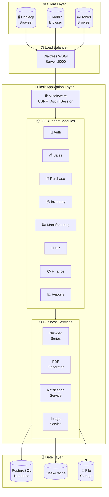
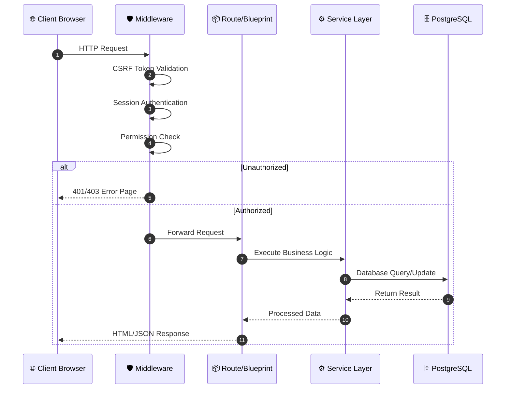
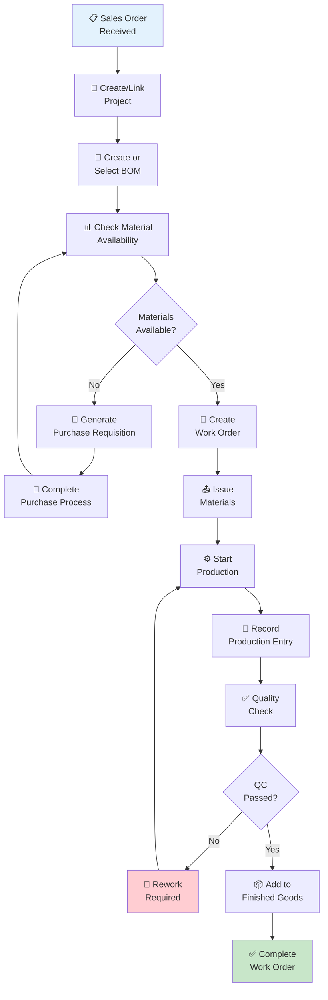
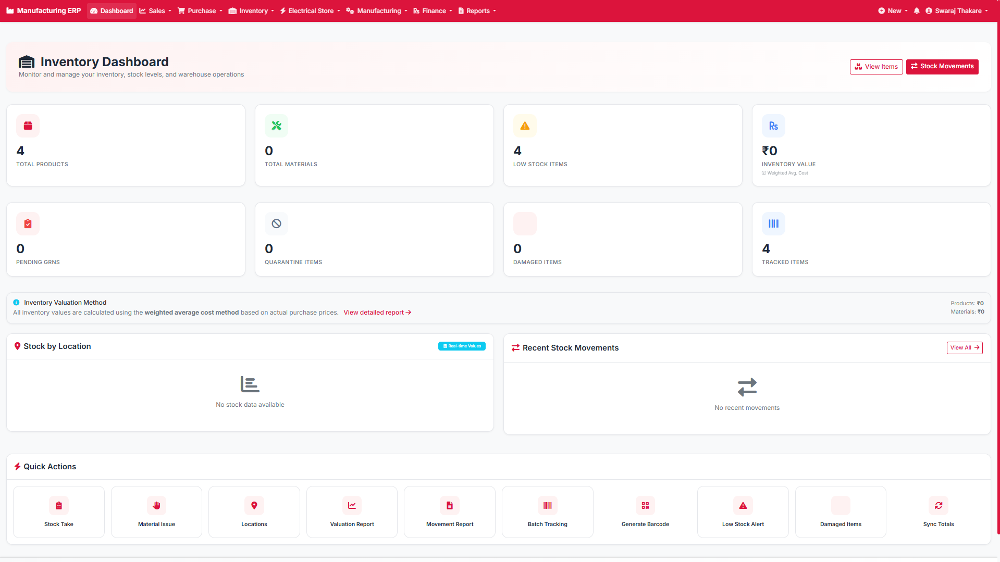
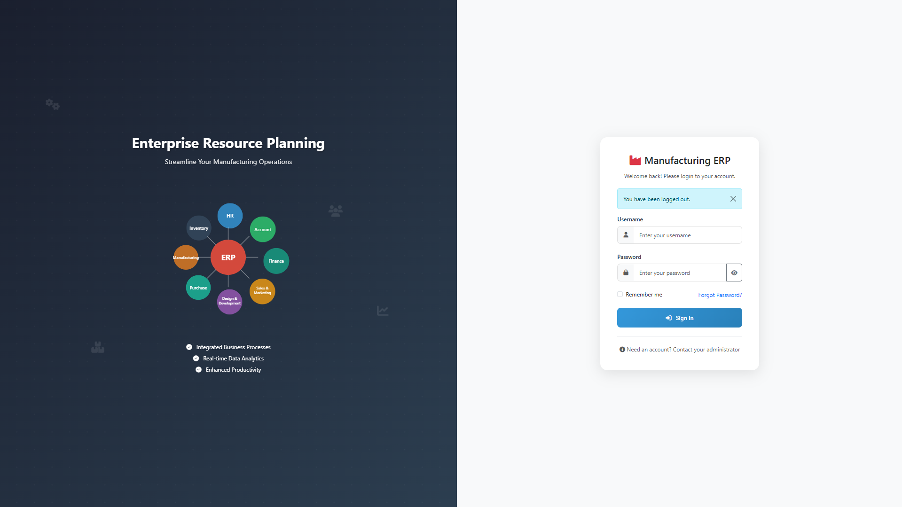
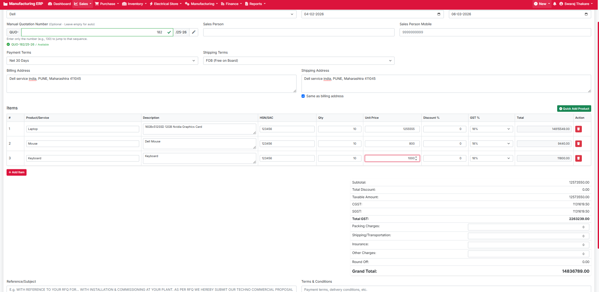
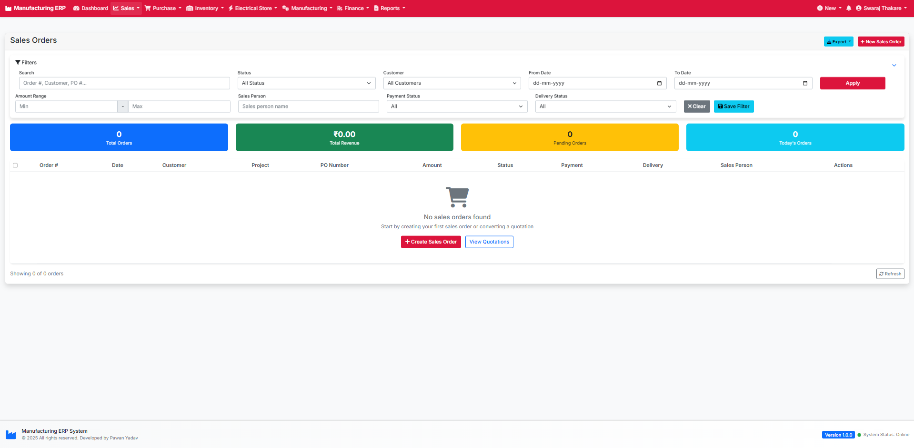
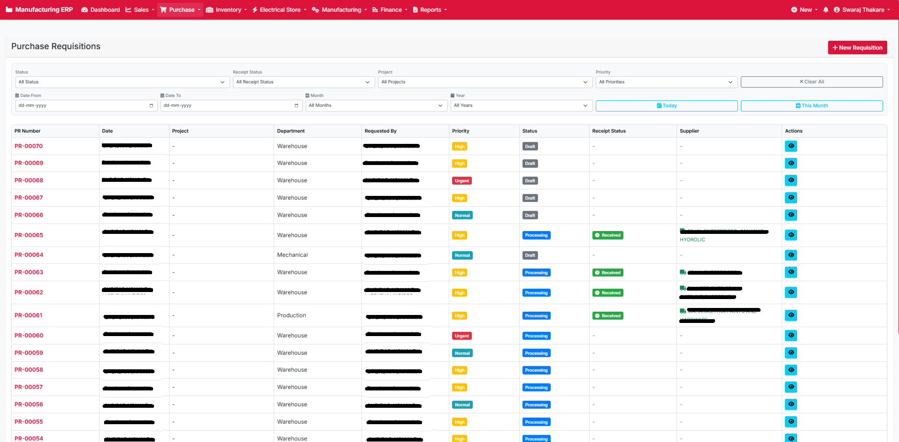

# 🏢 Enterprise Resource Planning (ERP) System

**A production-ready, full-featured ERP system for small & medium businesses**

[Features](#-key-features) • [Architecture](#-system-architecture) • [Modules](#-module-overview) • [Screenshots](#-screenshots) • [Tech Stack](#️-tech-stack)

---

## 📋 Overview

A comprehensive **Enterprise Resource Planning (ERP)** system built from scratch using Python Flask and PostgreSQL. This system manages complete business operations including **Sales, Purchase, Inventory, Manufacturing, HR, and Finance** modules with multi-user LAN support.

### 🎯 Key Highlights

| Metric | Details |
|--------|---------|
| 📊 **Database Models** | 77+ interconnected tables |
| 🔌 **API Modules** | 26 Flask Blueprints |
| 🔐 **Permissions** | 50+ granular permissions |
| 👥 **Multi-User** | LAN-based concurrent access |
| 📱 **Responsive** | Works on desktop, tablet, mobile |
| 🖨️ **Reports** | PDF & Excel export support |

---

## 🏗 System Architecture

### High-Level Overview

```mermaid
flowchart TB
    subgraph Client["🌐 Client Layer"]
        B1[("🖥️ Desktop<br/>Browser")]
        B2[("📱 Mobile<br/>Browser")]
        B3[("📟 Tablet<br/>Browser")]
    end

    subgraph LB["⚖️ Load Balancer"]
        WS["Waitress WSGI<br/>Server :5000"]
    end

    subgraph App["🚀 Flask Application Layer"]
        direction TB
        MW["🛡️ Middleware<br/>CSRF | Auth | Session"]
        
        subgraph Blueprints["📦 26 Blueprint Modules"]
            direction LR
            AUTH["🔐 Auth"]
            SALES["💰 Sales"]
            PURCH["🛒 Purchase"]
            INV["📦 Inventory"]
            MFG["🏭 Manufacturing"]
            HR["👥 HR"]
            FIN["💳 Finance"]
            RPT["📊 Reports"]
        end
        
        subgraph Services["⚙️ Business Services"]
            direction LR
            NUM["Number<br/>Series"]
            PDF["PDF<br/>Generator"]
            NOTIF["Notification<br/>Service"]
            IMG["Image<br/>Service"]
        end
    end

    subgraph Data["🗄️ Data Layer"]
        direction LR
        PG[("PostgreSQL<br/>Database")]
        CACHE[("Flask-Cache")]
        FS[("📁 File<br/>Storage")]
    end

    B1 & B2 & B3 --> WS
    WS --> MW
    MW --> Blueprints
    Blueprints --> Services
    Services --> PG & CACHE & FS

```

# Request-Response Flow

``` mermaid
sequenceDiagram
    autonumber
    participant C as 🌐 Client Browser
    participant M as 🛡️ Middleware
    participant R as 📦 Route/Blueprint
    participant S as ⚙️ Service Layer
    participant D as 🗄️ PostgreSQL

    C->>M: HTTP Request
    M->>M: CSRF Token Validation
    M->>M: Session Authentication
    M->>M: Permission Check
    
    alt Unauthorized
        M-->>C: 401/403 Error Page
    else Authorized
        M->>R: Forward Request
        R->>S: Execute Business Logic
        S->>D: Database Query/Update
        D-->>S: Return Result
        S-->>R: Processed Data
        R-->>C: HTML/JSON Response
    end
```

# Manufacturing Workflow

``` mermaid
flowchart TD
    A["📋 Sales Order<br/>Received"] --> B["📁 Create/Link<br/>Project"]
    B --> C["📑 Create or<br/>Select BOM"]
    C --> D["📊 Check Material<br/>Availability"]
    D --> E{"Materials<br/>Available?"}
    E -->|No| F["📄 Generate<br/>Purchase Requisition"]
    F --> G["🛒 Complete<br/>Purchase Process"]
    G --> D
    E -->|Yes| H["🔨 Create<br/>Work Order"]
    H --> I["📤 Issue<br/>Materials"]
    I --> J["⚙️ Start<br/>Production"]
    J --> K["📝 Record<br/>Production Entry"]
    K --> L["✅ Quality<br/>Check"]
    L --> M{"QC<br/>Passed?"}
    M -->|No| N["🔄 Rework<br/>Required"]
    N --> J
    M -->|Yes| O["📦 Add to<br/>Finished Goods"]
    O --> P["✅ Complete<br/>Work Order"]

    style A fill:#e3f2fd
    style P fill:#c8e6c9
    style N fill:#ffcdd2
```

# ⚡ Key Features

## 🔐 Authentication & Security
- Secure password hashing (Werkzeug)
- Two-Factor Authentication (OTP based)
- Role-Based Access Control (RBAC)
- 50+ granular permissions
- Failed login tracking & auto account lockout
- Session timeout management
- CSRF protection on all forms
- Complete audit logging

---

## 💼 Sales Management
- Customer master with credit limit tracking
- Quotation revision system (R1, R2, R3…)
- Convert quotation → sales order
- Delivery tracking
- Invoice generation with PDF export
- Partial/Full payment tracking
- Debit/Credit note management

---

## 🛒 Purchase Management
- Supplier master with performance rating
- Purchase requisition with multi-level approval
- Supplier quotation comparison
- Auto-generated purchase orders
- Goods Receipt Note (GRN) with quality check
- Vendor performance analytics

---

## 📦 Inventory Management
- Separate product & material masters
- Multi-location stock tracking
- Barcode & QR code generation
- 8 types of stock movements
- Batch & expiry tracking
- Low stock alerts & notifications
- Stock reservation for orders

---

## 🏭 Manufacturing
- Project management with timelines
- Bill of Materials (BOM) with cost calculation
- Work order management
- Production entry with quality checks
- Material issue & return tracking
- Consumption variance analysis
- Link projects to quotations & sales orders

---

## 👥 HR Management
- Complete employee master
- Daily attendance tracking
- Multiple leave types with approval workflow
- Salary structure with components
- Automatic payslip generation
- Tax declaration management
- HR document generation (Offer letter, Experience certificate)
- Training program management
- Exit process & clearance workflow

---

## ⚡ Electrical Inventory (Specialized Module)
- Material master with part codes
- Brand & category management
- Cupboard/Rack location tracking
- Stock entry with person tracking
- Handover to person/project/machine
- Return with condition assessment
- Complete transaction audit log

---

## 📊 Reports & Analytics
- Real-time dashboards with KPIs
- PDF report generation
- Excel export functionality
- Custom report builder
- Date-wise filtering
- Module-wise reports

---

# 📸 Screenshots

> Add images inside a `/screenshots` folder

| Module | Preview |
|--------|---------|
| Dashboard |  |
| Login (2FA) |  |
| Quotation |  |
| Sales Order |  |
| Purchase Order |  |

---

# 📝 Important Note

## ⚠️ Privacy Notice
This repository contains a sanitized documentation/demo version of the ERP system.

The actual production source code is maintained in a private repository to protect:
- Client-specific business logic
- Sensitive configurations
- Proprietary algorithms

This portfolio demonstrates the architecture, design patterns, and technical capabilities of the system.

---

# 📄 License
This project documentation is available under the MIT License.

---

# Contact and project enquiries

To learn more about the ERP architecture, workflows, or similar enterprise application development:

- GitHub: [PawanYadav007s](https://github.com/PawanYadav007s)
- LinkedIn: [Pawan Yadav](https://www.linkedin.com/in/pawan-yadav-42a16020a)

The production source code, credentials, client configuration, and operational data remain private.

---

### ❤️ Built with
Python • Flask • PostgreSQL
